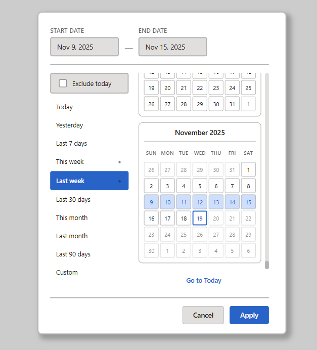
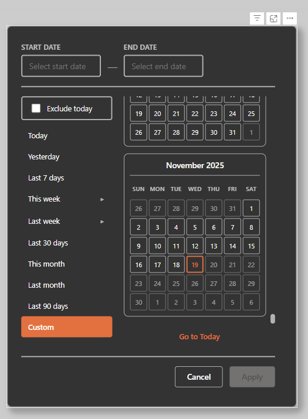
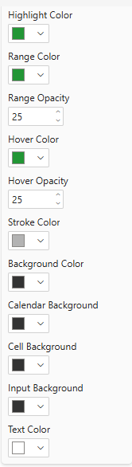
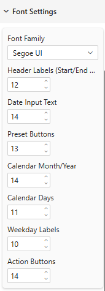
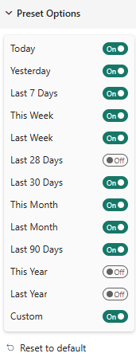

# Date Range Slicer - User Guide

## Overview
The Date Range Slicer is a custom Power BI visual that provides an intuitive interface for selecting date ranges. It combines preset date range options with interactive calendar selection, allowing users to quickly filter report data based on time periods.

## Installation

1. Download the `.pbiviz` file from this repository
2. In Power BI Desktop, click the ellipsis (...) in the Visualizations pane
3. Select "Import a visual from a file"
4. Navigate to and select the downloaded `.pbiviz` file
5. Click "OK" to confirm the import

## Getting Started

### Adding the Visual to Your Report

1. Click the Date Range Slicer icon in the Visualizations pane
2. Add a date column to the "Date" field well
3. Resize and position the visual on your report canvas

### Basic Usage

The visual is divided into three main areas:

- **Date Input Fields** (Top): Display and allow direct selection of start and end dates
- **Preset Buttons** (Left Panel): Quick access to common date ranges
- **Calendar View** (Right Panel): Interactive calendar for custom date selection

## Selecting Date Ranges

### Method 1: Preset Buttons

Click any preset button to instantly apply a predefined date range:

- **Today**: Current day only
- **Yesterday**: Previous day
- **Last 7 days**: Rolling 7-day period ending today
- **This week**: Current week (Sunday-Today or Monday-Today based on settings)
- **Last week**: Previous complete week (Sunday-Saturday or Monday-Sunday)
- **Last 28 days**: Rolling 28-day period
- **Last 30 days**: Rolling 30-day period
- **This month**: Current calendar month from the 1st to today
- **Last month**: Previous complete calendar month
- **Last 90 days**: Rolling 90-day period
- **This year**: Current year from January 1st to today
- **Last year**: Previous complete calendar year
- **Custom**: Enable manual calendar selection

### Method 2: Calendar Selection

1. Click "Custom" in the preset buttons (or click any date in the calendar)
2. Click your desired start date in the calendar
3. Click your desired end date in the calendar
4. The selected range will be highlighted
5. Use the "Go to Today" button to quickly navigate to the current month

### Method 3: Date Input Fields

1. Click on the "START DATE" or "END DATE" field at the top
2. A popup calendar will appear
3. Select your desired date
4. Repeat for the other date field if needed

## Exclude Today Option

The "Exclude today" checkbox is useful when working with incomplete data for the current day:

- Check this box to exclude the current day from all preset date ranges
- For example, "Last 7 days" with "Exclude today" checked will show 7 complete days, excluding today
- This setting does not affect custom calendar selections

## Applying Changes

After selecting your desired date range:

1. Click the **Apply** button to apply the filter to your report
2. Click the **Cancel** button to discard changes and revert to the previous selection

The filter will be applied to all visuals in your report that use the same date column.

## Customization

### Theme Examples

The visual supports extensive customization to match your report theme:

**Default Theme**

**Dark Theme**

**Green Theme**

### Color Settings

Access color settings in the Format pane (paint roller icon) under "Colors":

Available color options:
- **Highlight Color**: Selected preset button and selected dates
- **Range Color**: Date range between start and end dates
- **Range Opacity**: Transparency of the range color (0-100%)
- **Hover Color**: Dates when hovering with mouse
- **Hover Opacity**: Transparency of the hover color (0-100%)
- **Stroke Color**: Border color for calendar cells
- **Background Color**: Main visual background
- **Calendar Background**: Calendar area background
- **Cell Background**: Individual calendar cell background
- **Input Background**: Date input field background
- **Text Color**: All text elements

### Font Settings

Customize typography in the Format pane under "Font Settings":

Available font options:
- **Font Family**: Choose from 21 font families
- **Header Labels (Start/End Date)**: Font size for date input labels
- **Date Input Text**: Font size for selected dates display
- **Preset Buttons**: Font size for preset button text
- **Calendar Month/Year**: Font size for calendar headers
- **Calendar Days**: Font size for calendar date numbers
- **Weekday Labels**: Font size for weekday headers (Sun, Mon, etc.)
- **Action Buttons**: Font size for Apply/Cancel buttons

### Preset Options

Control which preset buttons are visible in the Format pane under "Preset Options":

Toggle any preset button on or off to customize the available options for your users. This is useful for:
- Simplifying the interface by showing only relevant date ranges
- Restricting users to specific reporting periods
- Creating a cleaner layout for smaller visual sizes

Click "Reset to default" to restore all preset buttons to their default visibility.

## Best Practices

### Report Design
- Position the visual prominently on your report for easy access
- Use consistent visual sizing across report pages
- Consider the visual's minimum size requirements for readability

### Data Filtering
- The visual filters all pages in your report once you click Apply
- The date filter persists across page navigation
- Use Power BI's "Sync slicers" feature to synchronize the visual across multiple pages
- Create bookmarks to save frequently used date ranges for quick access

### Performance
- For large datasets, preset buttons provide faster filtering than custom ranges
- The visual disables future dates (beyond today) automatically
- Consider the data volume when offering wide date ranges

## Troubleshooting

**Issue**: Visual is not filtering the report
- Ensure a date column is added to the Date field well
- Verify that other visuals use the same date column
- Check that you clicked the Apply button after selecting dates

**Issue**: Future dates are not selectable
- This is expected behavior - dates beyond today are disabled by default
- Future dates appear with reduced opacity in the calendar

**Issue**: Preset buttons are not visible
- Check the Preset Options in the Format pane
- Ensure the toggles are set to "On" for desired presets

**Issue**: Calendar is not responding to clicks
- Click the "Custom" preset button to enable calendar selection
- Ensure you are clicking within the calendar area

## Technical Requirements

- Power BI Desktop (latest version recommended)
- A date or datetime column in your dataset
- Minimum visual size: 300px width x 400px height (recommended)

## Support and Feedback

For issues, questions, or feature requests, please visit the repository's Issues page.
