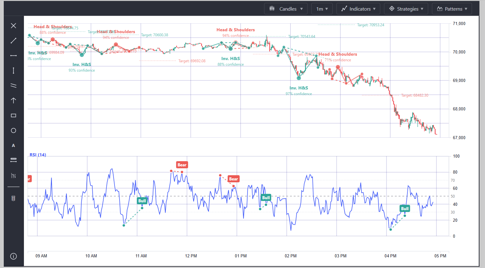
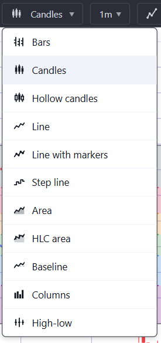
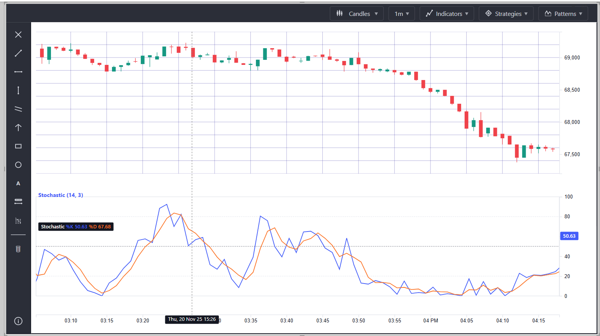
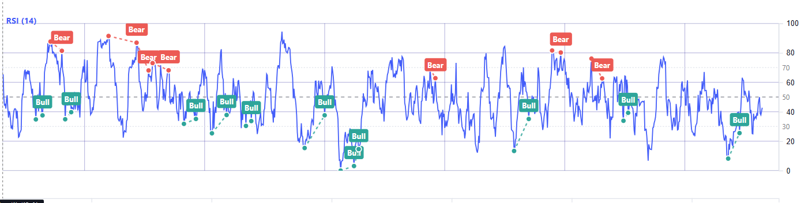
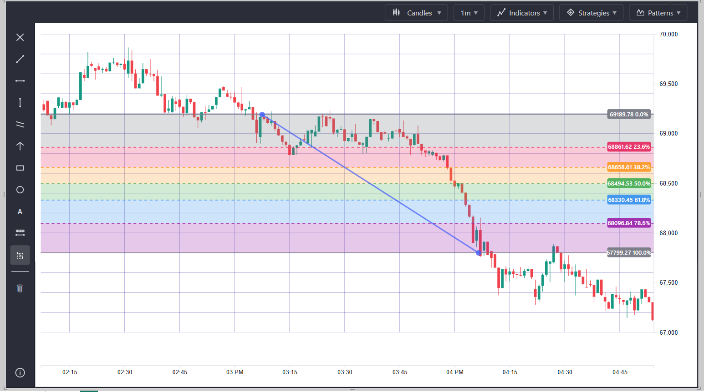
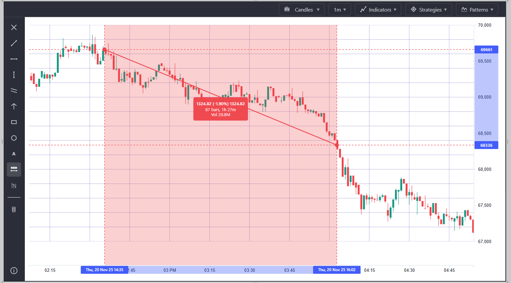

# Ultimate Trading Chart - User Guide

> **Preview Notice**: This visual is currently in preview. Some features may not function as expected. Please report any issues in the repository's Issues page.

## Overview
The Ultimate Trading Chart is a comprehensive Power BI custom visual designed for financial market analysis and technical trading. It provides professional-grade charting capabilities with multiple chart types, technical indicators, pattern detection, drawing tools, and timeframe aggregation - all within Power BI.



## Installation

1. Download the `.pbiviz` file from this repository
2. In Power BI Desktop, click the ellipsis (...) in the Visualizations pane
3. Select "Import a visual from a file"
4. Navigate to and select the downloaded `.pbiviz` file
5. Click "OK" to confirm the import

## Getting Started

### Adding the Visual to Your Report

1. Click the Ultimate Trading Chart icon in the Visualizations pane
2. Add your data fields to the field wells:
   - **Date**: Your datetime field
   - **Open**: Opening price
   - **High**: Highest price
   - **Low**: Lowest price
   - **Close**: Closing price
   - **Volume**: Trading volume (optional)
3. Resize and position the visual on your report canvas

### Data Requirements

Your dataset should include OHLCV (Open, High, Low, Close, Volume) data with timestamps. The visual works with:
- Stock market data
- Cryptocurrency data
- Forex data
- Commodity prices
- Any time-series financial data

Data should be sorted by date in ascending order for proper visualization.

## Interface Overview

The visual is organized into four main areas:

- **Toolbar** (Top): Chart type selector, timeframe dropdown, indicators, strategies, and patterns
- **Drawing Tools Sidebar** (Left): Line tools, shapes, and annotations
- **Main Chart Area** (Center): Price visualization with interactive crosshair
- **Indicator Panels** (Bottom): Technical indicators like RSI, MACD, and Volume

## Chart Types

### Changing Chart Types

1. Click the chart type dropdown in the toolbar (displays current type with icon)
2. Browse available chart types with visual previews
3. Click your desired chart type
4. The chart updates immediately

### Available Chart Types

**Candlestick Variations:**
- **Candlesticks**: Traditional Japanese candlestick charts showing open, high, low, close
- **Hollow Candles**: Hollow bodies indicate bullish candles, filled bodies indicate bearish
- **Bars**: Classic OHLC bar charts with horizontal ticks

**Line and Area Charts:**
- **Line**: Simple closing price line
- **Area**: Filled area under the closing price line
- **Baseline**: Area chart measured from a baseline
- **HLC Area**: High-Low-Close area visualization
- **High-Low**: Shows only the high-low price range

**Advanced Charts:**
- **Line with Markers**: Price line with data point markers
- **Step Line**: Stepped progression showing discrete price changes
- **Columns**: Vertical column representation of price data



## Timeframe Aggregation

### Enabling Timeframe Selection

1. Open the Format pane (paint roller icon)
2. Expand "Timeframe" section
3. Toggle "Show Timeframe Dropdown" to On
4. Enable your desired timeframes (1m, 5m, 15m, 30m, 1h, 4h, 1d, 1w, 1M)

### Using Timeframes

1. Click the timeframe dropdown in the toolbar (next to chart type)
2. Select your desired timeframe
3. The chart automatically aggregates your 1-minute data to the selected timeframe

**Available Timeframes:**
- **1m**: One-minute bars (raw data)
- **5m**: Five-minute bars
- **15m**: Fifteen-minute bars
- **30m**: Thirty-minute bars
- **1h**: One-hour bars
- **4h**: Four-hour bars
- **1d**: Daily bars
- **1w**: Weekly bars
- **1M**: Monthly bars

The aggregation properly calculates OHLCV data ensuring accurate technical analysis at any timeframe.

## Technical Indicators

### Adding Indicators

1. Click the "Indicators" dropdown in the toolbar
2. Hover over any indicator to see its description
3. Click to add the indicator to your chart
4. The indicator appears either on the main chart or in a separate panel below

### Overlay Indicators (Displayed on Main Chart)

- **Simple Moving Average (SMA)**: Trend-following indicator showing average price over a period
- **Exponential Moving Average (EMA)**: Weighted moving average giving more importance to recent prices
- **Bollinger Bands**: Volatility indicator with upper, middle, and lower bands
- **Fibonacci Retracement**: Key support and resistance levels based on Fibonacci ratios
- **Ichimoku Cloud**: Comprehensive trend and momentum system with cloud visualization
- **Parabolic SAR**: Dots above/below price indicating potential reversal points

### Panel Indicators (Displayed Below Chart)

- **RSI (Relative Strength Index)**: Momentum oscillator (0-100) showing overbought/oversold conditions
- **MACD**: Trend-following momentum indicator with signal line and histogram
- **ATR (Average True Range)**: Volatility measurement showing average price movement
- **Stochastic**: Momentum oscillator comparing closing price to price range
- **ADX (Average Directional Index)**: Trend strength indicator
- **Volume**: Trading volume bars with bullish/bearish coloring



### Removing Indicators

1. Click the info button (i) at the bottom of the left sidebar
2. Select "Remove X indicators" to clear all indicators
3. Or select "Remove X drawings, X indicators & X patterns" to clear everything

## Pattern Detection

### Enabling Pattern Detection

1. Click the "Patterns" dropdown in the toolbar
2. Select "Head and Shoulders"
3. The visual automatically scans your data and highlights detected patterns

### Head and Shoulders Patterns

The visual detects two types:

**Bearish Head and Shoulders** (Top Reversal):
- Left shoulder, head, right shoulder formation at market tops
- Indicates potential downward trend reversal
- Shows neckline, confidence score, and price target

**Inverse Head and Shoulders** (Bottom Reversal):
- Upside-down pattern at market bottoms
- Indicates potential upward trend reversal
- Shows neckline, confidence score, and price target

**Pattern Visualization:**
- Key points marked with circles (head is larger)
- Lines connecting shoulders and head
- Dashed neckline for support/resistance
- Confidence percentage based on pattern symmetry
- Projected target price with dashed line

### Removing Patterns

1. Click the info button (i) at the bottom of the left sidebar
2. Select "Remove X patterns" to disable pattern detection
3. Or click the pattern name in the Patterns dropdown again to toggle it off

## Trading Strategies

### RSI Divergence Strategy

1. Click the "Strategies" dropdown in the toolbar
2. Select "RSI Divergence"
3. The visual automatically detects divergences between price and RSI
4. A checkmark appears next to active strategies

**What it detects:**
- **Bullish Divergence**: Price makes lower lows while RSI makes higher lows (potential upward reversal)
- **Bearish Divergence**: Price makes higher highs while RSI makes lower highs (potential downward reversal)

The RSI indicator is automatically added if not already present.



## Drawing Tools

### Using Drawing Tools

1. Click any tool icon in the left sidebar
2. Click and drag on the chart to draw
3. Release to complete the drawing
4. Click the cursor tool to exit drawing mode

### Line Tools

- **Trend Line**: Draw support/resistance lines by clicking start and end points
- **Horizontal Line**: Draw horizontal price levels
- **Vertical Line**: Mark specific time points
- **Ray**: Draw a line that extends infinitely in one direction
- **Arrow**: Draw directional arrows for annotations

### Shape Tools

- **Rectangle**: Draw rectangular zones by clicking opposite corners
- **Circle**: Draw circular zones
- **Triangle**: Draw triangle patterns

### Fibonacci Tools

- **Fibonacci Retracement**: Click start and end points to automatically draw 0%, 23.6%, 38.2%, 50%, 61.8%, and 100% levels
- **Fibonacci Extension**: Project potential price targets beyond the current range



### Advanced Tools

- **Price Range**: Highlight a specific price zone with a colored rectangle
- **Measurement Tool**: Click two points to see:
  - Price difference
  - Percentage change
  - Number of bars between points
  - Time duration



### Managing Drawings

**Clearing Drawings:**
1. Click the info button (i) at the bottom of the left sidebar
2. Select "Remove X drawings" to clear all drawings

**Persistence:**
- All drawings are automatically saved with your Power BI report
- Drawings persist across sessions
- Reopen your report and all drawings are restored

## Interactive Features

### Zoom and Pan

**Zooming:**
- Use mouse wheel to zoom in/out on the chart
- Zoom range: 50% to 2000% magnification
- Zoom centers on mouse cursor position

**Panning:**
- Click and drag anywhere on the chart to pan left/right
- Chart prevents scrolling beyond your data range
- Smooth navigation across large datasets

### Crosshair

The crosshair follows your mouse and displays:
- Current price level
- Date/time at cursor position
- OHLCV values for the nearest data point

Toggle crosshair in Format pane > Chart Settings > Show Crosshair

### Data Tooltips

Hover over any candle or bar to see:
- Date/Time
- Open, High, Low, Close prices
- Volume
- Indicator values (if applicable)

## Customization

### Color Settings

Access in Format pane > Colors:

**Price Colors:**
- **Bullish/Up Color**: Color for rising candles/bars (default: green)
- **Bearish/Down Color**: Color for falling candles/bars (default: red)

**Volume Colors:**
- **Volume Up Color**: Volume bars when price rises
- **Volume Down Color**: Volume bars when price falls

**Background:**
- **Grid Color**: Gridline color
- **Background Color**: Chart background color

### Gridline Settings

Access in Format pane > Gridlines:

- **Gridline Color**: Color of horizontal and vertical grid lines
- **Gridline Opacity**: Transparency of grid lines (0-100%)

### Chart Settings

Access in Format pane > Chart Settings:

- **Show Grid**: Toggle grid visibility on/off
- **Show Crosshair**: Enable/disable crosshair cursor
- **Show Legend**: Display indicator legends
- **Candle Width**: Adjust width of candles/bars (1-20 pixels)
- **Main Chart Height**: Percentage of space for main chart vs indicators (50-90%)

### Timeframe Settings

Access in Format pane > Timeframe:

- **Show Timeframe Dropdown**: Enable/disable timeframe selector
- **Individual Timeframes**: Toggle each timeframe on/off (1m, 5m, 15m, etc.)

## Best Practices

### Report Design

- Allow adequate space for the visual (minimum 800px width recommended)
- Position indicator panels below the main chart for readability
- Use consistent color schemes across your report
- Consider dark themes for reduced eye strain during analysis

### Data Preparation

- Ensure data is sorted by date in ascending order
- Remove duplicate timestamps
- Handle gaps in trading data (weekends, holidays) appropriately
- Limit data to 10,000 rows for optimal performance

### Real-Time Trading Data Setup

For optimal performance with live trading data, especially when using the included CryptoCompare query ([btc_1minute_7days.pq](btc_1minute_7days.pq)):

**Recommended Architecture:**
1. **Store data in a SQL database** rather than querying APIs directly
2. Use **Dual storage mode** (Import + DirectQuery) in Power BI Desktop:
   - Historical data: Import mode for fast performance
   - Recent data: DirectQuery mode for real-time updates
3. Configure **automatic page refresh** in Power BI Desktop:
   - Set page refresh interval (e.g., 30 seconds, 1 minute)
   - Ensure your data source supports DirectQuery refresh
4. **Power BI Service (Premium Per User or Premium capacity)**:
   - Enable automatic page refresh in the service
   - Set refresh interval to 30 seconds or as needed
   - Configure scheduled refreshes for Import mode data

**Benefits of this approach:**
- Reduced API rate limiting issues
- Faster query performance
- Real-time chart updates without manual refresh
- Better reliability and data consistency
- Historical data always available even if API is down

**Example workflow:**
1. Use a scheduled job/script to pull data from CryptoCompare (or other API) into your SQL database
2. Connect Power BI to SQL database using Dual mode
3. Enable page refresh with 30-second intervals
4. Publish to Power BI Service with PPU or Premium capacity
5. Real-time trading chart updates automatically

### Analysis Workflow

1. Start with the chart type that suits your analysis (candlesticks for detailed OHLC, line for trends)
2. Add 1-2 key indicators (avoid cluttering with too many)
3. Use timeframe aggregation to identify trends at different scales
4. Draw support/resistance lines as you identify them
5. Enable pattern detection for automated insights
6. Save your report to persist all settings and drawings

### Performance Tips

- Use timeframe aggregation to reduce data points for large datasets
- Remove unused indicators to improve rendering speed
- Limit drawing tools to essential annotations
- Disable pattern detection when not needed

## Troubleshooting

**Issue**: Chart is not displaying
- Verify all required fields are mapped (Date, Open, High, Low, Close)
- Check that your date field is recognized as a Date/DateTime type
- Ensure data is not filtered to zero rows

**Issue**: Indicators are not appearing
- Check that indicator panels have sufficient space below the main chart
- Adjust "Main Chart Height" in Chart Settings to allocate space
- Verify data has enough points for indicator calculations (e.g., SMA needs at least 20 points for period=20)

**Issue**: Timeframe dropdown not showing
- Enable "Show Timeframe Dropdown" in Format pane > Timeframe
- Ensure at least one timeframe toggle is enabled
- Refresh the visual if needed

**Issue**: Patterns not being detected
- Ensure you have sufficient data (at least 50-100 data points recommended)
- Check that price movements form recognizable patterns
- Pattern detection requires clear shoulder-head-shoulder formations

**Issue**: Drawings disappeared
- Drawings are saved automatically - try reopening the report
- Ensure you clicked outside the visual after drawing
- Check that you didn't clear drawings using the info button

**Issue**: Chart is slow or laggy
- Reduce data to fewer rows (use Power BI filters)
- Use timeframe aggregation to reduce data points
- Remove unused indicators
- Disable pattern detection if not needed

## Technical Requirements

- Power BI Desktop (latest version recommended)
- OHLCV financial data with datetime column
- Minimum visual size: 600px width x 400px height
- Maximum data points: 10,000 rows (for optimal performance)

## Example Data Format

```
Date                Open    High    Low     Close   Volume
2024-01-01 09:30   150.00  152.50  149.75  151.25  1000000
2024-01-01 09:31   151.25  153.00  151.00  152.75  1200000
2024-01-01 09:32   152.75  154.25  152.50  153.50  1100000
```

## Support and Feedback

For issues, questions, or feature requests, please visit the repository's Issues page.

## Example Files

### Sample Report

[**Download: The Ultimate Trading Chart.pbix**](The%20Ultimate%20Trading%20Chart.pbix)

An example Power BI report demonstrating:
- Proper data structure and field mapping
- Various chart types and their use cases
- Technical indicator configurations
- Pattern detection examples
- Drawing tool demonstrations
- Timeframe aggregation in action

Download the example file to explore all features and use it as a template for your own reports.

### CryptoCompare Data Query

[**Download: btc_1minute_7days.pq**](btc_1minute_7days.pq)

A Power Query (M) script to fetch Bitcoin 1-minute OHLCV data from CryptoCompare API for the last 7 days. This query can be imported into Power BI Desktop to get started quickly with live cryptocurrency data.

**Note:** For production use, consider storing data in a SQL database with Dual mode and automatic page refresh as described in the [Real-Time Trading Data Setup](#real-time-trading-data-setup) section.
